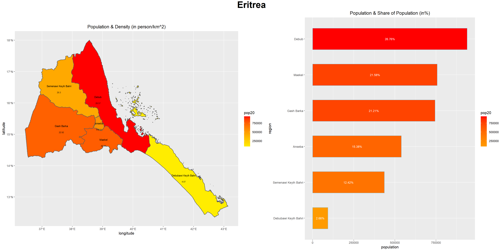

# Creating a Geometric Bar Plot with your Simple Feature object
## delivrable 
### The plot on the left shows the polulation and density of regions in Eritrea (in person/km^2).  
### The plot on the right shows the polulation and share of population of regions in Eritrea (in percentage).  
Just remember to add the "fill" command into the ggplot, otherwise you will never be able to add colours into the plot.  
Eritrea's population condenses largely in the northwest part of the country with a less than 5 percentage of population on the islands.  

## stretch goal 1
### This bar plot shows the share of population of subregions in Eritrea marked with different colours.

