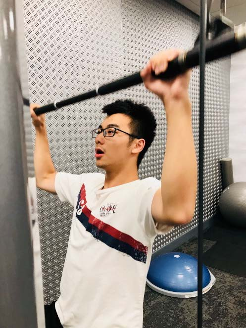

# Welcome to my website for data 100.
## This is an introduction of myself.
I have many hobbies in my spare time: going to the gym, playing the piano, Taekwondo, all kinds of sports, go games, and of course traveling. Other than that, I really enjoy talking with people privately in deep thoughts. I like to listen to their stories and be able to help them as much as I can. That is one of the reasons I will choose psychology as my intended major.  
My passion towards programming began quite late compared to some of my friends----half a year ago. I still remember the time when I first encounter computer science in my middle school and found these lines of confusing codes bored me to death.However, things changed dramatically after I learnt how this ‘magic’ works to communicate human being to computers and felt the intensive accomplishment of creating.That is why I am here. Hope we will have a nice semester together!  
I love fitness so much that I will spend up to 4 to 5 hours per week. I still maintain a record of daily exercise on an app for three years by now.I like reading. It’s something that I will not do regularly, but funny enough, every time a book catches my interest, I tend to spend all of my time in order to finish reading it. Pets like cats and dogs are something that I literally want to have. Unfortunately, my father is allergic to them, so no animals are allowed at home.  

## A picture of myself

## Informal response
[challenge problem](challenge.md)  
[Project1](project1.md)

## Formal response
[DS reflection#1](ds_reflection1.md)

