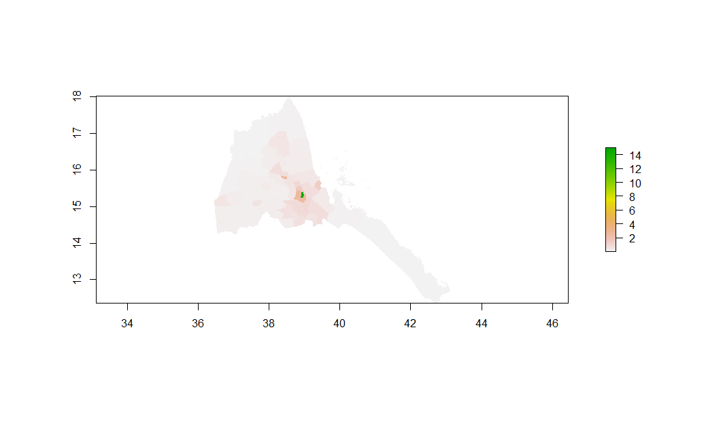
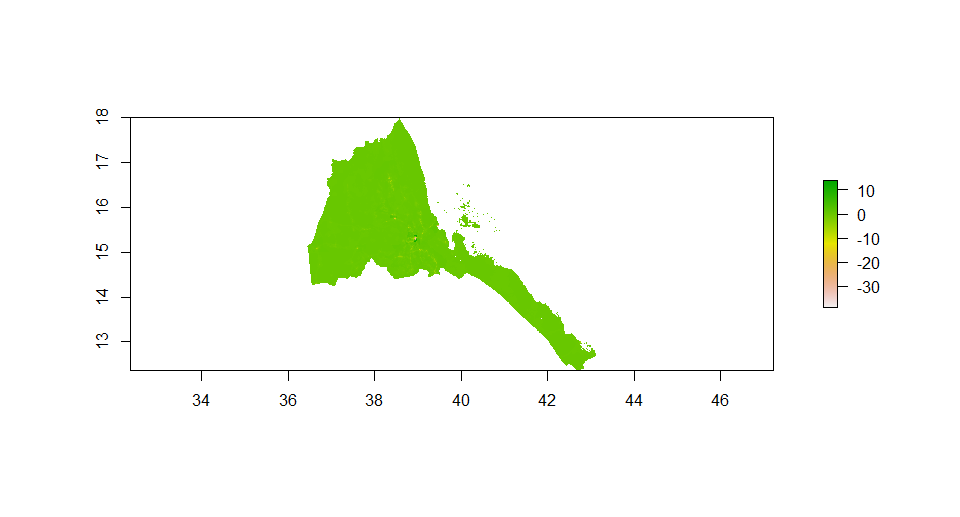
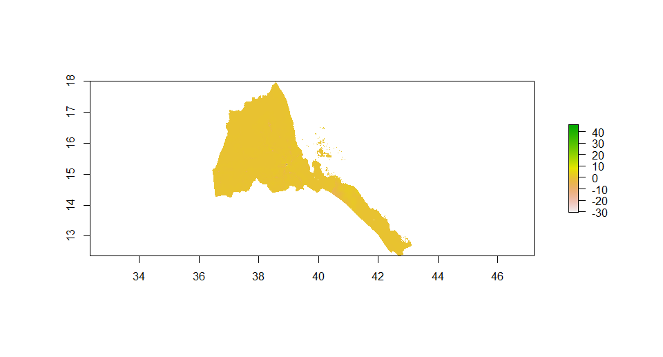
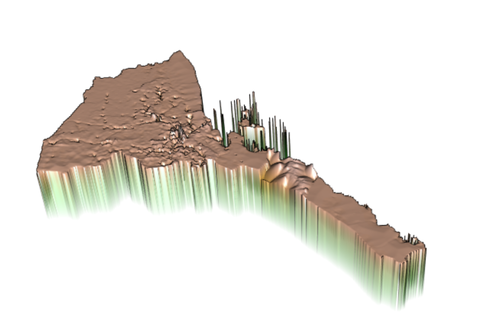

# Investigating and Comparing Results
Here are three sets of plots that describe the predicted population of Eritrea, the corresponding predictor is sum and mean. The third set changes the response variable into log of population. Each set has a plot that decribes the predicted population of Eritrea, a plot that describes the difference between the predicted result and the WorldPop estimates for 2015, and a 3D plot that visualizes the population or difference.
## Response variable is population and the predictors are sum of covariates

## Response variable is population and the predictors are mean of covariates

## Reponse variable is log of population and the predictors are mean of covariates

## eri_pop15

