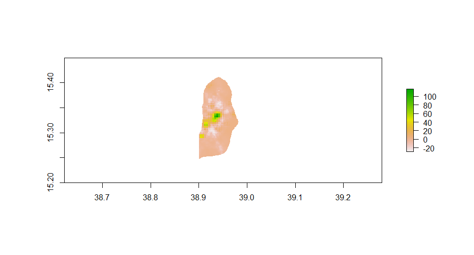
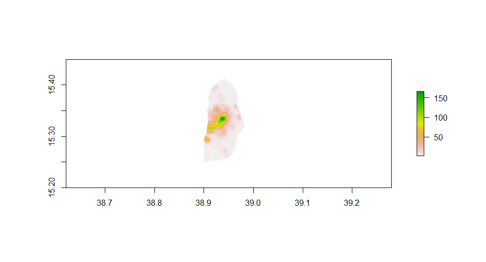

# Modeling & Predicting Spatial Values
This lab measures the effectiveness of linear models that are used to describe population allocaiton in Eritrea's capital --- Asmara City.
## diff plot

## population plot

## 3d plot

## overall mapview

