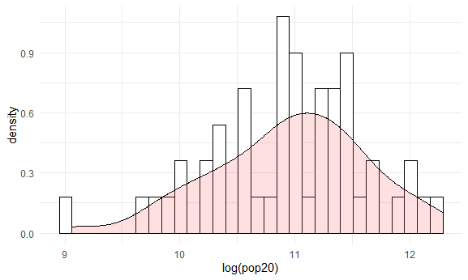
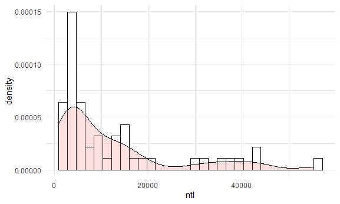

# Project 3 Challenge 1
## Acquiring, Modifying, and Describing the Data: Eritrea
### The plots below are two combined histograms with overlapping density curve plots that describe the correlationship between Eritrea’s population at the adm2 level as a dependent variable and two of the other variables.
This plot depicts the correlationship between log of population 2020 and density.  
The distribution is approximately normal with the a little skewness to the left.
  
This plot depicts the correlationship between night time lights and density.  
The distribution skews to the right, which means that subregions with large population density tends to have lower night time lights values.  

