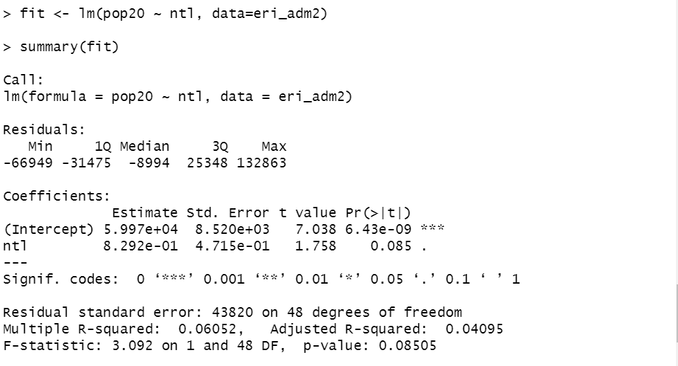
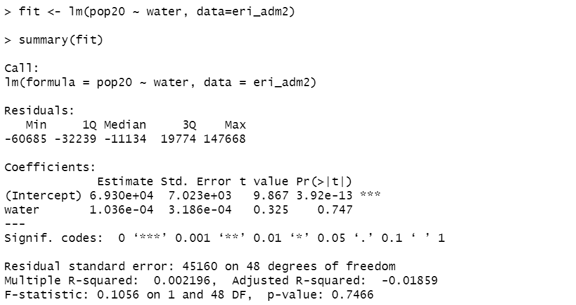

# project3 challenge2
## Two plots below are the linear model plots that illustrate the correlations between Eritrea’s population and the night-time lights values & bodies of water within the country.
### The ntl distribution depicts a relatively postive correlation between density and night-time lights.  
  
The screenshot below is the model’s description using the fit() and summary() commands. Since we can see the R squared value is 0.06052, there’s a weak relationship between the two variables.

### While The water distribution depicts a constant correlation between density and bodies of water within the country.  
  
The screenshot below is the model’s description using the fit() and summary() commands. Since we can see the R squared value is 0.002196, there’s a weak relationship between the two variables.

