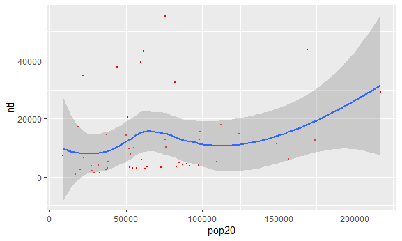
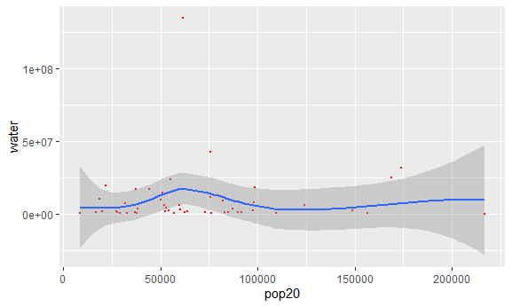

# project3 challenge2
## Two plots below are the linear model plots that illustrate the correlations between Eritrea’s population and the night-time lights values & bodies of water within the country.
### The ntl distribution depicts a relatively postive correlation between density and night-time lights.  
  
Call:
lm(formula = pop20 ~ ntl, data = eri_adm2)

Residuals:
   Min     1Q Median     3Q    Max 
-66949 -31475  -8994  25348 132863 

Coefficients:
             Estimate Std. Error t value Pr(>|t|)    
(Intercept) 5.997e+04  8.520e+03   7.038 6.43e-09 ***
ntl         8.292e-01  4.715e-01   1.758    0.085 .  
---
Signif. codes:  0 ‘***’ 0.001 ‘**’ 0.01 ‘*’ 0.05 ‘.’ 0.1 ‘ ’ 1

Residual standard error: 43820 on 48 degrees of freedom
Multiple R-squared:  0.06052,	Adjusted R-squared:  0.04095 
F-statistic: 3.092 on 1 and 48 DF,  p-value: 0.08505
### While The water distribution depicts a constant correlation between density and bodies of water within the country.  
  
Call:
lm(formula = pop20 ~ water, data = eri_adm2)

Residuals:
   Min     1Q Median     3Q    Max 
-60685 -32239 -11134  19774 147668 

Coefficients:
             Estimate Std. Error t value Pr(>|t|)    
(Intercept) 6.930e+04  7.023e+03   9.867 3.92e-13 ***
water       1.036e-04  3.186e-04   0.325    0.747    
---
Signif. codes:  0 ‘***’ 0.001 ‘**’ 0.01 ‘*’ 0.05 ‘.’ 0.1 ‘ ’ 1

Residual standard error: 45160 on 48 degrees of freedom
Multiple R-squared:  0.002196,	Adjusted R-squared:  -0.01859 
F-statistic: 0.1056 on 1 and 48 DF,  p-value: 0.7466
