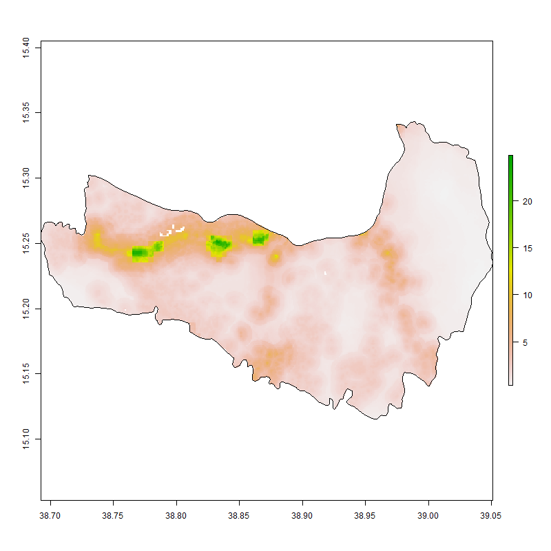
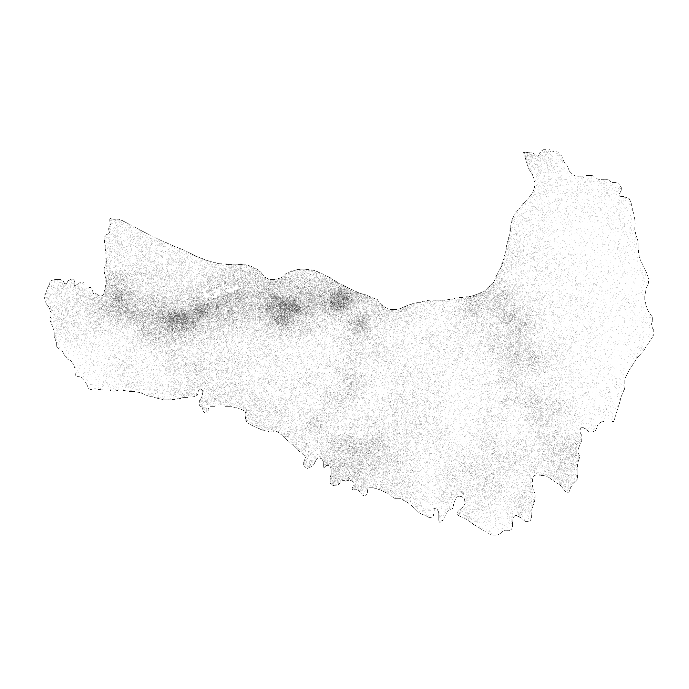
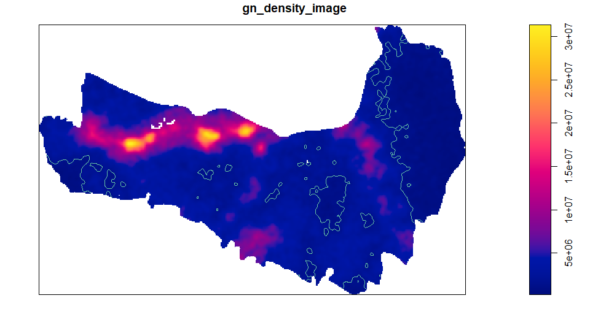
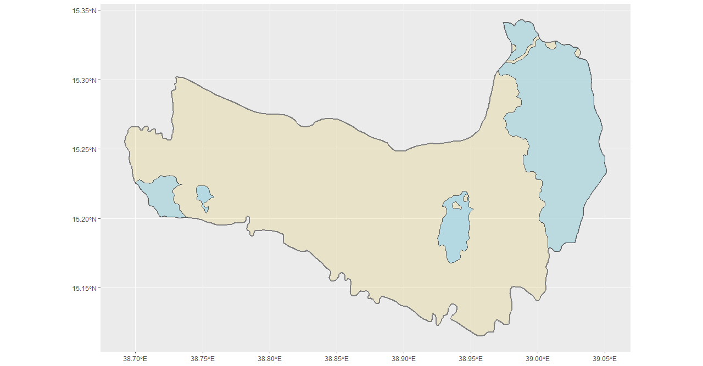
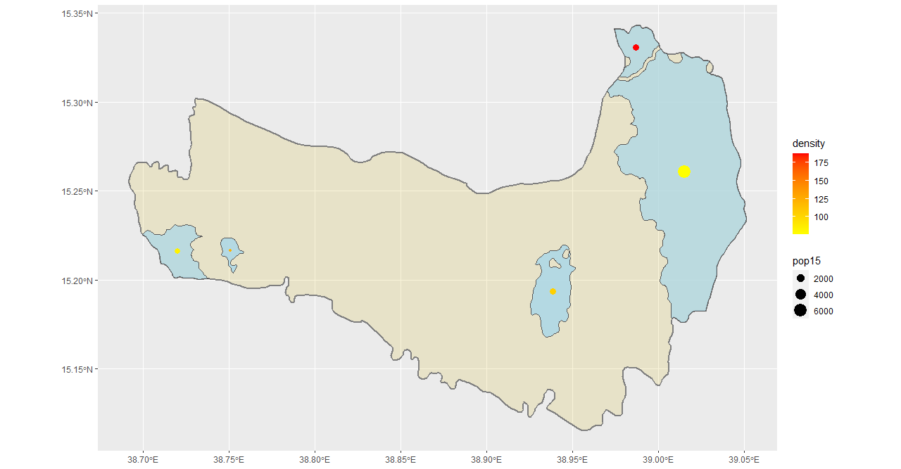
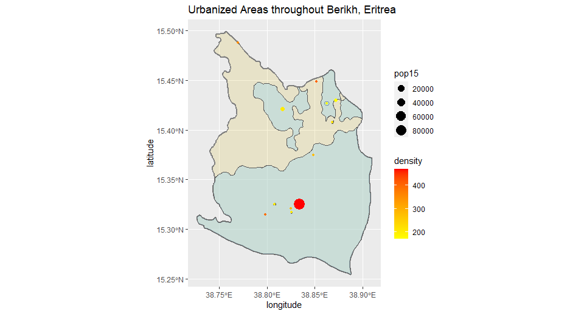
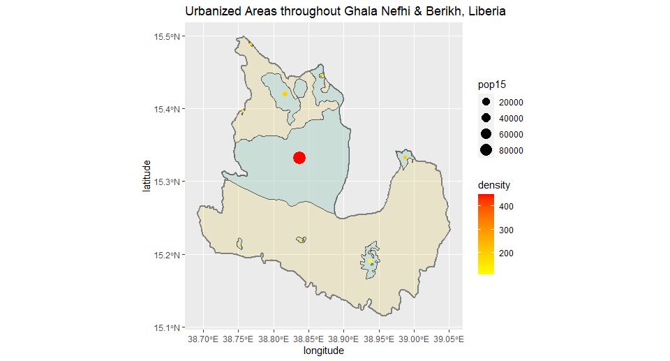

# Accessibility 1
## population scale of Ghala Nefhi, Eritrea

## a pixel image that represents a function that describes the probability of the population density at each pixel throughout the entire space in Ghala Nefhi.

## Urbanized areas throughout Ghala Nefhi, Eritrea

## shown in population size and density scale

# Stretch goal
## Urbanized areas throughout Berikh, Eritrea

## combined areas (Ghala Nefhi & Berikh)

