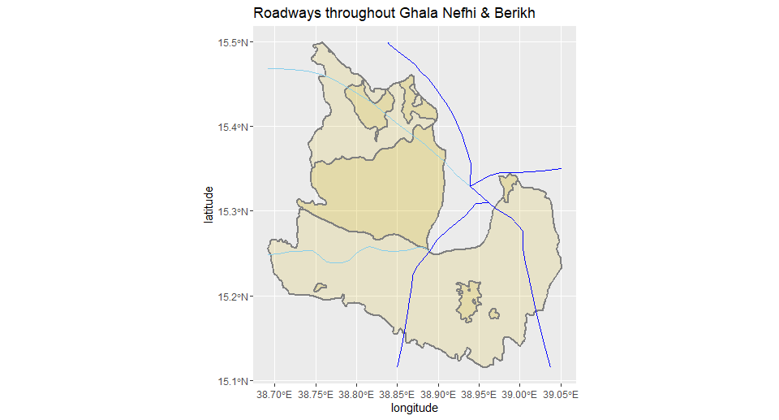

# Accessibility 2
### In this part, we add roadways and health care facilities to the resulting plot in Accessibility 1.
## roadways in Ghala Nefhi & Berikh

## health care facilities in Ghala Nefhi & Berikh
### The problem here is that in these two regions, there is NO health care facility.(I also searched in google map to investigate) Thus, I include health facilties in Asmara, the capital city of the country just beside the two regions.

