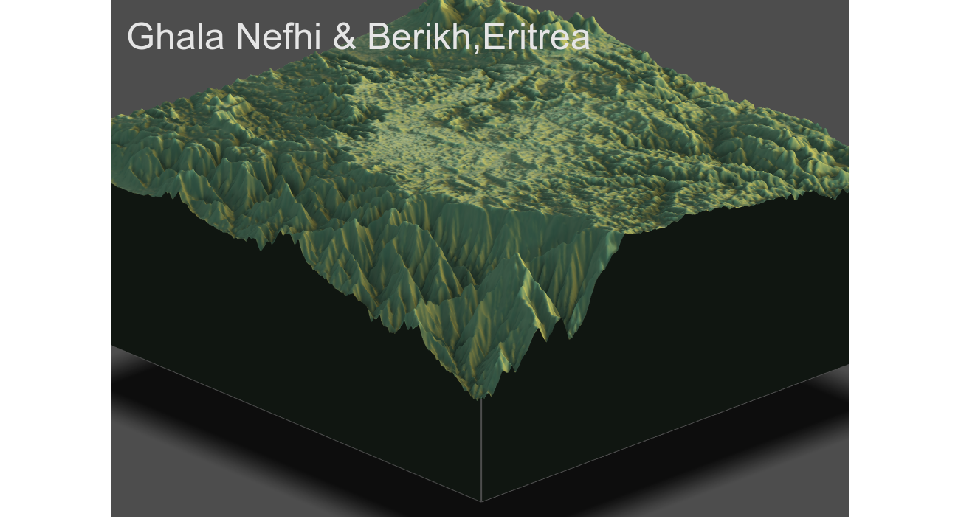
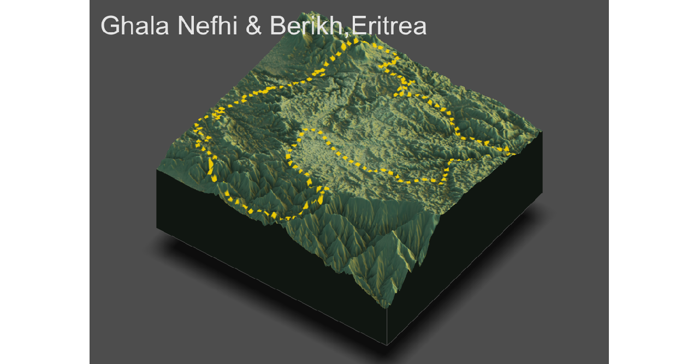
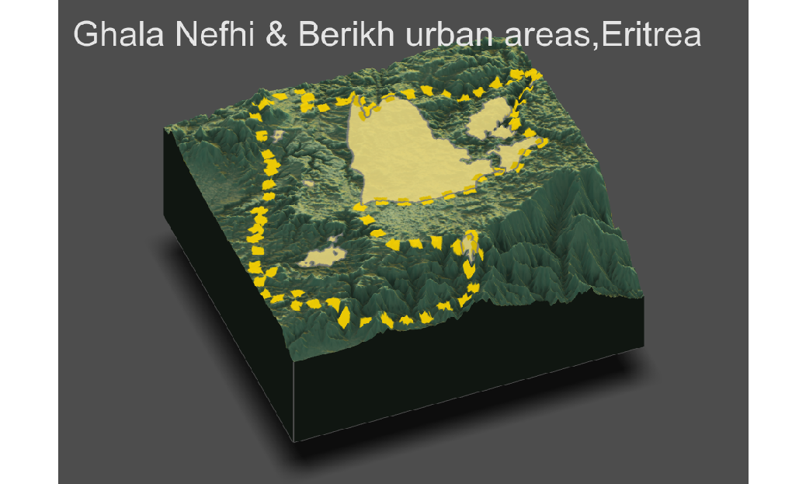
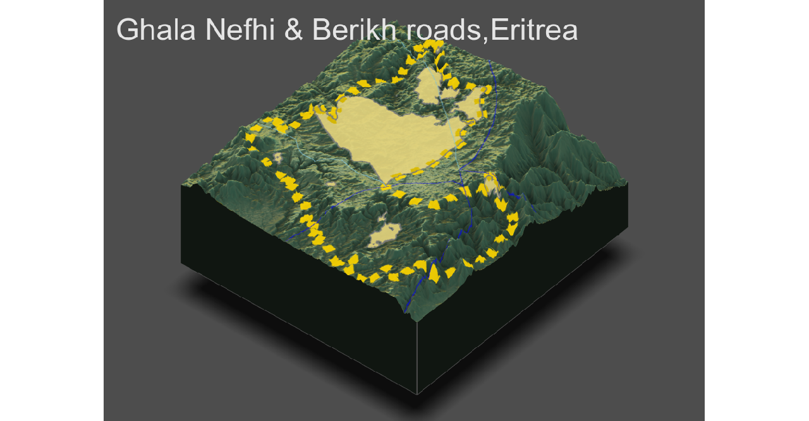
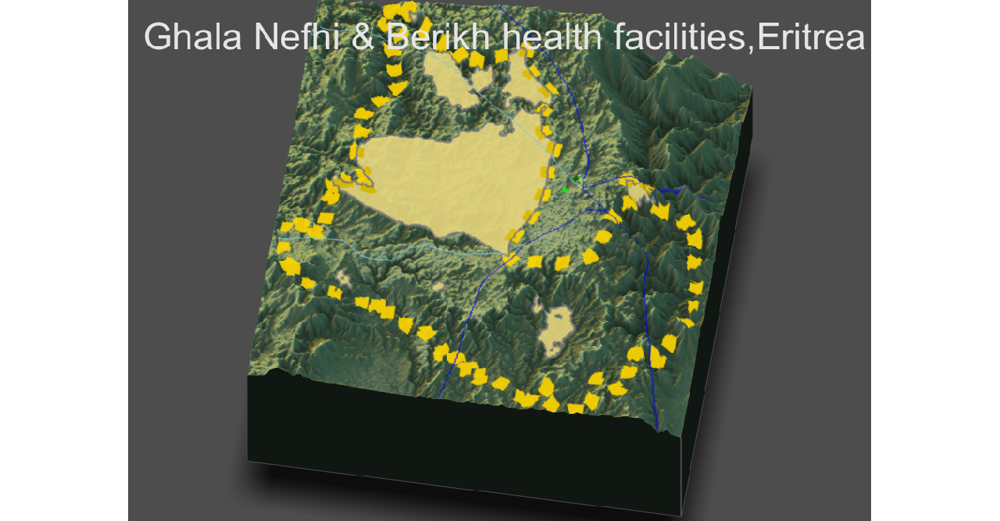
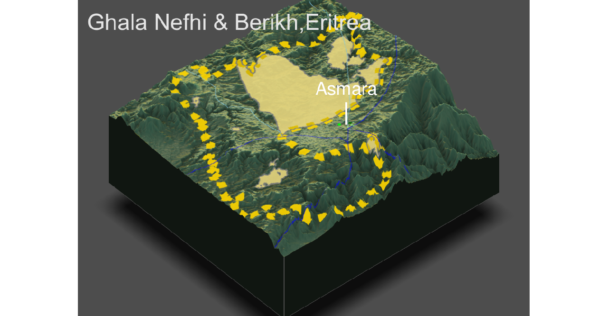

# Accessibility 3
### In this part, we display 3D plots that depict infrastructure and urban areas in Ghala Nefhi & Berikh.
## the original plot

## plot that involves the boundary lines of Ghala Nefhi & Berikh.

## plot with borders and urban areas.

## plot with roads

## plot with health care facilities

## the final plot with the primary urban area
### Again, I choose to show the urban area "Asmara" city that correlates with roads and health care facilities depicted on the plot.

